# Welltok HipChat Emoticons

We've expanded on the core set of [emoticons included with HipChat](http://hipchat-emoticons.nyh.name).

## Creating your own emoticons

We are using HipChat's built-in emoticon feature, which means an admin must upload the image in order for it to start showing up. However, you can still create a pull request to get your icon into the repo, then let a HipChat admin know. (Helpful tool for creating GIFs [EZgif animated GIF resizer](http://ezgif.com/resize))

* Max dimensions are 30px tall and 30px wide
* Use a transparent PNG or animated GIF for best results
* Images must be under 100Kb
* Currently limited to 100 custom emoticons

## Emoticons

| Image                                           | Shortcut        |
| :---------------------------------------------: | --------------- |
|                        | 007             |
| 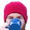                 | adrian          |
|                      | alex            |
|                        | ali             |
|            | ambulance       |
|                | angular         |
|            | argentina       |
|                    | bacon           |
| 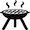                 | barbie          |
| 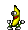                 | banana          |
|                | bandaid         |
|              | bandaid2        |
|                        | ben             |
|                  | bender          |
|                      | bike            |
|            | bluesteel       |
|                      | bond            |
|                    | bond2           |
|                    | bond3           |
|                    | bond4           |
|                    | bond5           |
|                    | bond6           |
|                  | brazil          |
|                | broncos         |
|                    | bryan           |
|                | bueller         |
|              | cafewell        |
|            | catalonia       |
|                  | chachi          |
|                | charlie         |
|                  | clippy          |
| 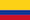             | colombia        |
|              | colorado        |
|              | dogecoin        |
|                  | denver          |
|                | denver2         |
|                    | diplo           |
| 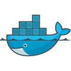                 | docker          |
| 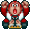         | donkeykong      |
|  | fingerscrossed  |
|                  | fitbit          |
|                      | gabe            |
|                | germany         |
|                      | goal            |
|                | goodbye         |
|        | greatdivide     |
|                    | gross           |
|              | guinness        |
|                  | heroku          |
|              | highfive        |
|            | highfive2       |
|        | honeybadger     |
|                    | italy           |
|                      | john            |
|              | kangaroo        |
|            | kangaroo2       |
|            | kangaroo3       |
|                    | kevin           |
|                  | kitten          |
|                | kitten2         |
|                | kitten3         |
| 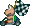       | koopatroopa     |
| 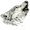             | lonewolf        |
| 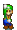                   | luigi           |
| 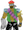         | majorlazer      |
|                  | marvin          |
|                    | maxim           |
| 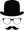             | mustache        |
|            | mustache2       |
|            | mustache3       |
|                      | nate            |
|                    | nixit           |
|                    | nolan           |
|                | nyancat         |
|                | patrick         |
|                | penguin         |
|              | postgres        |
|        | publicenemy     |
|                        | pug             |
|                      | pug2            |
|                      | pug3            |
| 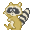               | raccoon         |
|                    | rails           |
|                      | rain            |
|                | redcard         |
|                      | rock            |
|                      | ruby            |
|      | saywhatagain    |
|              | seahawks        |
|                | seattle         |
|              | seattle2        |
|              | seattle3        |
|                      | self            |
| 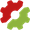           | semaphore       |
|                | shabnam         |
|                    | shibe           |
|                  | shrimp          |
|                | sidekiq         |
|                  | soccer          |
|                | solomon         |
|                    | spain           |
|                    | steve           |
| 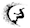                     | surf            |
|                  | sydney          |
|        | takemymoney     |
|                    | tuaca           |
| 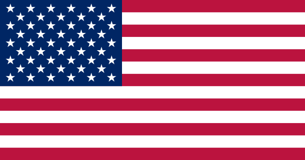                       | usa             |
|                        | wil             |
| 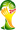             | worldcup        |
|          | yellowcard      |
|              | yoadrian        |
