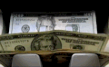
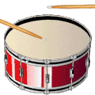
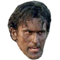
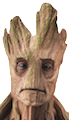
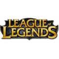
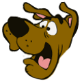

# Welltok HipChat Emoticons

We've expanded on the core set of [emoticons included with HipChat](http://hipchat-emoticons.nyh.name).

## Creating your own emoticons

We are using HipChat's built-in emoticon feature, which means an admin must upload the image in order for it to start showing up. However, you can still create a pull request to get your icon into the repo, then let a HipChat admin know. (Helpful tool for creating GIFs [EZgif animated GIF resizer](http://ezgif.com/resize))

* Max dimensions are 120px tall and 120px wide, can't be less than 64px
* Use a transparent PNG or animated GIF for best results
* Images must be under 1MB
* Currently limited to 100 custom emoticons

## Emoticons

| Image                                             | Shortcut        |
| :-----------------------------------------------: | --------------- |
|                          | 007             |
|                    | adrian          |
|                          | ali             |
|              | ambulance       |
|                  | angular         |
|                          | ara             |
|                      | bacon           |
|                    | banana          |
|                  | bandaid         |
|                | bandaid2        |
|                          | ben             |
|                        | bike            |
|              | bluesteel       |
|                        | bond            |
|                  | broncos         |
|                      | bryan           |
|                  | bueller         |
|                      | cache           |
|                | cafewell        |
|                    | carlos          |
|                    | chachi          |
|                  | charlie         |
|                    | clippy          |
|                | colombia        |
|                | colorado        |
|                    | denver          |
|                  | denver2         |
|                      | dewey           |
|                    | docker          |
|            | donkeykong      |
|                | drumroll        |
|    | fingerscrossed  |
|                    | fitbit          |
|                        | fred            |
|                        | gabe            |
|                  | germany         |
|                  | goodbye         |
|                    | groovy          |
|                      | gross           |
|                | guinness        |
|                    | heroku          |
|                | highfive        |
|              | highfive2       |
|          | honeybadger     |
|                  | humpday         |
|                | iamgroot        |
|                        | john            |
|                     		  | jim             |
|                | kangaroo        |
|              | kangaroo2       |
|                      | Katie           |
|                      | kevin           |
|                    | kitten          |
|                  | kitten2         |
|                  | kitten3         |
|          | koopatroopa     |
|  | leagueoflegends |
|                | lonewolf        |
|                      | luigi           |
|                    | marvin          |
|                        | mike            |
|                | mustache        |
|              | mustache2       |
|              | mustache3       |
|                      | nacho           |
|                        | nate            |
|                      | nixit           |
|                      | nolan           |
|                  | nyancat         |
|                  | patrick         |
|                  | penguin         |
|                | postgres        |
|                          | pug             |
|                        | pug2            |
|                        | pug3            |
|                  | raccoon         |
|                      | rails           |
|                        | rain            |
|                  | redcard         |
|                        | rock            |
|                    | roland          |
|                        | ruby            |
|                    | ruhroh          |
|                          | sam             |
|        | saywhatagain    |
|                | seahawks        |
|                  | seattle         |
|                | seattle2        |
|                | seattle3        |
|              | semaphore       |
|                  | sidekiq         |
|                    | soccer          |
|                  | solomon         |
|                      | steve           |
|          | takemymoney     |
|                          | usa             |
|                          | wil             |
|            | yellowcard      |
|                | yoadrian        |
