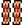
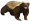
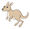
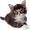
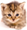
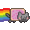
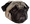
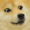

# Welltok HipChat Emoticons

We've expanded on the core set of [emoticons included with HipChat](http://hipchat-emoticons.nyh.name).

## Creating your own emoticons

We are using HipChat's built-in emoticon feature, which means an admin must upload the image in order for it to start showing up. However, you can still create a pull request to get your icon into the repo, then let a HipChat admin know. (Helpful tool for creating GIFs [EZgif animated GIF resizer](http://ezgif.com/resize))

* Max dimensions are 30px tall and 30px wide
* Use a transparent PNG or animated GIF for best results
* Images must be under 100Kb
* Currently limited to 100 custom emoticons

## Emoticons

| Image                                       | Shortcut     |
| :-------------------------------------:     | -----------  |
|                    | 007          |
|            | angular      |
|                | bacon        |
|              | bender       |
|                  | bike         |
|        | bluesteel    |
|                  | bond         |
|                | bond2        |
|                | bond3        |
|                | bond4        |
|                | bond5        |
|                | bond6        |
|            | broncos      |
|            | bueller      |
|          | cafewell     |
|              | chachi       |
|          | colorado     |
|          | dogecoin     |
|              | fitbit       |
|                  | gabe         |
|                | gross        |
|              | heroku       |
|    | honeybadger  |
|          | kangaroo     |
|        | kangaroo2    |
|        | kangaroo3    |
|              | kitten       |
|            | kitten2      |
|            | kitten3      |
|              | marvin       |
|                | nixit        |
|            | nyancat      |
|            | penguin      |
|          | postgres     |
|  | public_enemy |
|                    | pug          |
|                  | pug2         |
|                  | pug3         |
|                | rails        |
|                  | rain         |
|                  | rock         |
|                  | ruby         |
|  | saywhatagain |
|            | seattle      |
|                | shibe        |
|            | sidekiq      |
|    | takemymoney  |
|                | tuaca        |
